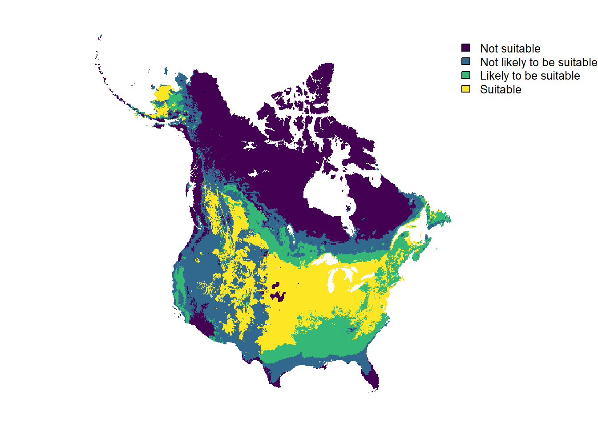

# Basic workflow

## Introduction

Biologists working at regulatory agencies like the United States
Department of Agriculture and the Canadian Food Inspection Agency often
need to quickly estimate the potential geographic distribution of a
plant species while performing a formal pest risk analysis. The
[protoclim](https://cfia-pdam.github.io/protoclim/) package is designed
to help biologists perform this task by estimating a plant species’
potential geographic distribution on the basis of the species’ known
distribution in climatically similar areas elsewhere in the world
(i.e. climate matching).

## Data

To provide an overview of the basic
[protoclim](https://cfia-pdam.github.io/protoclim/) workflow, we will
use the following example datasets:

1.  `bryonia_alba`, GBIF occurrence data for *Bryonia alba*, the
    [eastern white-bryony](https://www.gbif.org/taxon/NJ97)

2.  [`climate_layers_ssp370_2011_2040()`](https://cfia-pdam.github.io/protoclim/reference/climate_layers_ssp370_2011_2040.md),
    downscaled Köppen-Geiger classes, plant hardiness zones, and
    precipitation bands for present day (2011-2040) climate under the
    SSP3-7.0 high emission scenario.

To get familiar with the data, let’s look at a few rows of the
occurrence data for *Bryonia alba*

``` r

head(bryonia_alba)
#> # A tibble: 6 x 9
#>   datasetName basisOfRecord species countryCode decimalLatitude decimalLongitude
#>   <chr>       <chr>         <chr>   <chr>                 <dbl>            <dbl>
#> 1 Artportalen HUMAN_OBSERV~ Bryoni~ SE                     59.3             18.1
#> 2 Artportalen HUMAN_OBSERV~ Bryoni~ SE                     59.0             18.3
#> 3 Artportalen HUMAN_OBSERV~ Bryoni~ SE                     57.2             12.2
#> 4 Artportalen HUMAN_OBSERV~ Bryoni~ SE                     57.2             12.2
#> 5 Artportalen HUMAN_OBSERV~ Bryoni~ SE                     57.1             12.4
#> # i 1 more row
#> # i 3 more variables: habitat <chr>, locality <chr>, year <int>
```

Now let’s look at the output of
[`climate_layers_ssp370_2011_2040()`](https://cfia-pdam.github.io/protoclim/reference/climate_layers_ssp370_2011_2040.md),
which is a `SpatRaster` object with three layers: one for Köppen-Geiger
climate classes, one for precipitation bands, and one plant hardiness
zones. Each layer is actually an average, the mode, taken across
multiple global climate models. See the
[`protoclimData`](https://github.com/CFIA-PDAM/protoclimData) repository
on GitHub for additional details.

``` r

climate_layers_ssp370_2011_2040()
#> class       : SpatRaster
#> size        : 2088, 4320, 3  (nrow, ncol, nlyr)
#> resolution  : 0.08333333, 0.08333333  (x, y)
#> extent      : -180.0001, 179.9999, -90.00014, 83.99986  (xmin, xmax, ymin, ymax)
#> coord. ref. : lon/lat WGS 84 (EPSG:4326)
#> source      : climate_layers_ssp370_2011_2040.tif
#> colors rgb  : 1, 2, 3
#> names       : kgc_mode, pb_mode, phz_mode
#> min values  :        1,       1,        1
#> max values  :       30,      11,       28
```

Before proceeding with the rest of the workflow, we recommend spending
some time cleaning the occurrence data in `bryonia_alba`. Cleaning
occurrence data is a nuanced and often labour-intensive process that
requires a good understanding of the plant species’ biology. Here, we
will perform automated cleaning using the
[CoordinateCleaner](https://ropensci.github.io/CoordinateCleaner/)
package. We recommend reading [Cleaning GBIF data for the use in
biogeography](https://docs.ropensci.org/CoordinateCleaner/articles/Cleaning_GBIF_data_with_CoordinateCleaner.html)
from the
[CoordinateCleaner](https://ropensci.github.io/CoordinateCleaner/)
authors for additional information on cleaning occurrence data.

``` r

# Remove all occurrence records without coordinates
bryonia_alba <- dplyr::filter_out(
  bryonia_alba,
  is.na(decimalLatitude),
  is.na(decimalLongitude)
)

# Convert ISO 2 country codes to ISO 3 country codes for use with CoordinateCleaner
bryonia_alba <- dplyr::mutate(
  bryonia_alba,
  countryCode = countrycode::countrycode(
    countryCode,
    origin = 'iso2c',
    destination = 'iso3c'
  )
)

# Keep only clean occurrence data using CoordinateCleaner
bryonia_alba <- CoordinateCleaner::clean_coordinates(
  bryonia_alba,
  value = "clean"
)
```

## Climate Matching

The first step in the
[protoclim](https://cfia-pdam.github.io/protoclim/) climate matching
workflow is to classify the suitability of each level of the three
climate layers in
[`climate_layers_ssp370_2011_2040()`](https://cfia-pdam.github.io/protoclim/reference/climate_layers_ssp370_2011_2040.md).
In essence, this process involves combining the occurrence data in
`bryonia_alba` with each climate variable in
[`climate_layers_ssp370_2011_2040()`](https://cfia-pdam.github.io/protoclim/reference/climate_layers_ssp370_2011_2040.md),
counting the number of occurrence records in each level of each climate
variable, and calculating the proportion of occurrence records within
each level of each climate variable. The proportion of occurrence
records within each level of each climate variable informs the
suitability classifications based on the following cutoffs:

| Proportion      | Suitability               |
|:----------------|:--------------------------|
| \>1%            | Suitable                  |
| ≥0.5% and \<1%  | Likely to be suitable     |
| \>0% and \<0.5% | Not likely to be suitable |
| 0%              | Not suitable              |

This process is performed by the
[`classify_levels()`](https://cfia-pdam.github.io/protoclim/reference/classify_levels.md)
function, which takes as input a `SpatRaster` object of climate layers
and a tibble of occurrence data. The output is a list of tibbles, one
per climate layer, with the suitability classification for each level of
each climate layer.

``` r

level_suitability <- classify_levels(
  climate_layers_ssp370_2011_2040(),
  bryonia_alba
)

level_suitability
#> $kgc_mode
#> # A tibble: 30 x 4
#>   level occurrence proportion suitability              
#>   <int>      <int>      <dbl> <ord>                    
#> 1     1          0     0      Not suitable             
#> 2     2          0     0      Not suitable             
#> 3     3          0     0      Not suitable             
#> 4     4          0     0      Not suitable             
#> 5     5          6     0.0847 Not likely to be suitable
#> # i 25 more rows
#> 
#> $pb_mode
#> # A tibble: 11 x 4
#>   level occurrence proportion suitability              
#>   <int>      <int>      <dbl> <ord>                    
#> 1     1         17      0.240 Not likely to be suitable
#> 2     2        169      2.39  Suitable                 
#> 3     3       5088     71.9   Suitable                 
#> 4     4       1410     19.9   Suitable                 
#> 5     5        276      3.90  Suitable                 
#> # i 6 more rows
#> 
#> $phz_mode
#> # A tibble: 28 x 4
#>   level occurrence proportion suitability 
#>   <int>      <int>      <dbl> <ord>       
#> 1     1          0          0 Not suitable
#> 2     2          0          0 Not suitable
#> 3     3          0          0 Not suitable
#> 4     4          0          0 Not suitable
#> 5     5          0          0 Not suitable
#> # i 23 more rows
```

As shown in the above output, we classified the suitability of each
level of each climate variable for *Bryonia alba* based on the known
distribution of *Bryonia alba* and its proportional occurrence in each
level. For example, *Bryonia alba* has never occurred in the
Köppen-Geiger climate classes 1 through 4 and these levels are therefore
classified as `Not suitable`.

The next step is to feed these suitability classifications back into the
global raster of climate data so that each cell within the raster can be
assigned a suitability classification based on each climate variable.
The suitability classifications for Köppen-Geiger classes, plant
hardiness zones, and precipitation bands, are likely to differ as these
variables measure different aspects of climate. Therefore, we take the
minimum suitability classification across the three climate variables to
assign an overall suitability classification to each cell in the raster.
This process is performed by the
[`classify_cells()`](https://cfia-pdam.github.io/protoclim/reference/classify_cells.md)
function, which takes as input a `SpatRaster` object of climate layers
and a list of tibbles with the suitability classifications for each
level of each climate layer. The output is a `SpatRaster` object with
the original climate variables relabelled by their suitability as well
as an additional layer containing the overall suitability classification
for each cell in the raster.

``` r

cell_suitability <- classify_cells(
  climate_layers_ssp370_2011_2040(),
  level_suitability
)

cell_suitability
#> class       : SpatRaster
#> size        : 2088, 4320, 4  (nrow, ncol, nlyr)
#> resolution  : 0.08333333, 0.08333333  (x, y)
#> extent      : -180.0001, 179.9999, -90.00014, 83.99986  (xmin, xmax, ymin, ymax)
#> coord. ref. : lon/lat WGS 84 (EPSG:4326)
#> source(s)   : memory
#> varnames    : climate_layers_ssp370_2011_2040
#>               climate_layers_ssp370_2011_2040
#>               climate_layers_ssp370_2011_2040
#>               
#> names       :     kgc_mode,      pb_mode,     phz_mode,      overall
#> min values  : Not suitable, Not suitable, Not suitable, Not suitable
#> max values  :     Suitable,     Suitable,     Suitable,     Suitable
```

At this point, we have a global raster of climate data with each cell
classified by its overall suitability for *Bryonia alba*. The final step
is to visualize the results. You can tailor the visualization to a
particular pest risk area and use whichever supported visualization
library you prefer. Here, we will crop the raster to the extent of
Canada and the Canada and the continental United States, repropject the
raster to an appropriate projection, and plot the climate suitability
map.

``` r

pra <-
  rnaturalearth::ne_states(country = c("Canada", "United States of America")) |>
  dplyr::filter_out(name == "Hawaii") |>
  terra::vect()

cell_suitability[["overall"]] |>
  terra::crop(pra, mask = TRUE) |>
  terra::project("EPSG:3347", method = "near", progress = FALSE) |>
  terra::trim() |>
  terra::plot(axes = FALSE)
```

[](https://cfia-pdam.github.io/protoclim/articles/basic_workflow_files/figure-html/unnamed-chunk-7-1.png)
