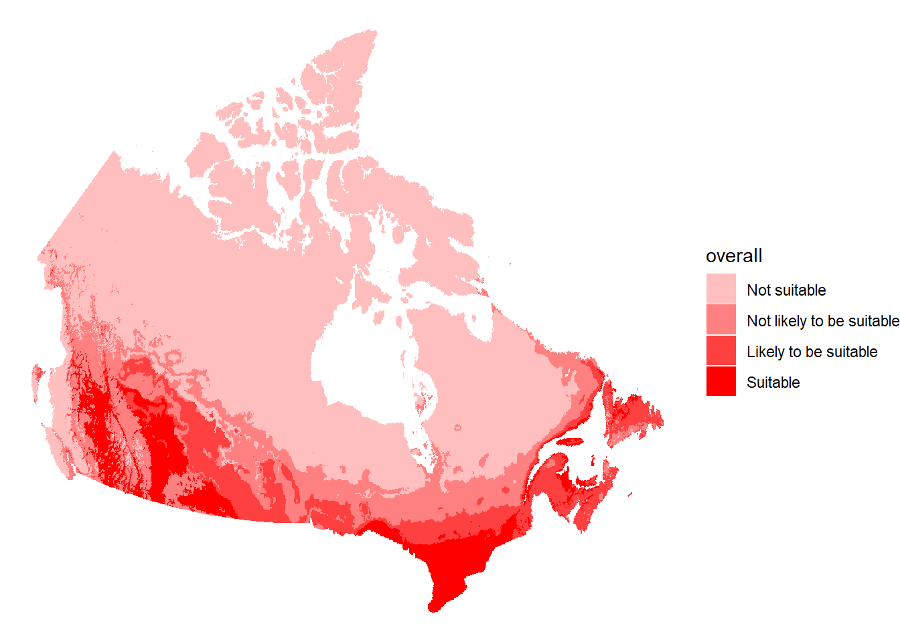

# Example workflow

Researchers, botanists, and those working at National Plant Protection
Organization’s (NPPOs) often need to assess the climatic suitability of
a potential invasive plant species in a given region. The workflow
illustrated here shows how to use the
[protoclim](https://cfia-pdam.github.io/protoclim/) package to assess
the climatic suitability of *Bryonia alba*, the [eastern
white-bryony](https://www.gbif.org/taxon/NJ97), in North America.

Two types of data are required to assess the climatic suitability of a
plant species with [protoclim](https://cfia-pdam.github.io/protoclim/):

1.  A data frame of biological occurrence data from GBIF.

2.  A global raster of Köppen-Geiger climate classes, plant hardiness
    zones, and precipitation bands.

Available within [protoclim](https://cfia-pdam.github.io/protoclim/) is
the `bryonia_alba` dataset, which contains GBIF occurrence data for
`Bryonia alba`, as well as the helper function
[`climate_layers_ssp370_2011_2040()`](https://cfia-pdam.github.io/protoclim/reference/climate_layers_ssp370_2011_2040.md)
which returns a downscaled global raster of Köppen-Geiger climate
classes, plant hardiness zones, and precipitation bands for SSP 3.7.0
for 2011-2040.

> **Tip**
>
> The climate data provided by
> [`climate_layers_ssp370_2011_2040()`](https://cfia-pdam.github.io/protoclim/reference/climate_layers_ssp370_2011_2040.md)
> is relatively low resolution and only covers one emission scenario and
> time period. Higher resolution climate data for various emission
> scenarios and time periods are pre-compiled and available for download
> on Zenodo at
> [10.5281/zenodo.21400410](https://zenodo.org/records/21400410).

To start, load [protoclim](https://cfia-pdam.github.io/protoclim/) into
your R session.

``` r

library(protoclim)
```

Then look at `bryonia_alba` which contains GBIF occurrence data for
*Bryonia alba*.

``` r

dplyr::glimpse(bryonia_alba)
#> Rows: 9,997
#> Columns: 9
#> $ datasetName      <chr> "Artportalen", "Artportalen", "Artportalen", "Artport~
#> $ basisOfRecord    <chr> "HUMAN_OBSERVATION", "HUMAN_OBSERVATION", "HUMAN_OBSE~
#> $ species          <chr> "Bryonia alba", "Bryonia alba", "Bryonia alba", "Bryo~
#> $ countryCode      <chr> "SE", "SE", "SE", "SE", "SE", "SE", "SE", "SE", "SE",~
#> $ decimalLatitude  <dbl> 59.30050, 58.96808, 57.23162, 57.18711, 57.12997, 57.~
#> $ decimalLongitude <dbl> 18.07314, 18.33057, 12.23263, 12.21921, 12.38392, 12.~
#> $ habitat          <chr> "", "Snår vid vägen", "", "", "häck i villaträdgård",~
#> $ locality         <chr> "Skanskvarns koloniområde, Srm", "Utö värdshus 75 m O~
#> $ year             <int> 2014, 2014, 1988, NA, 1993, NA, NA, 1992, 1995, 2014,~
```

Then look at the raster of climate data packaed with
[protoclim](https://cfia-pdam.github.io/protoclim/) that comes with
layers for Köppen-Geiger climate classes, precipitation bands, and plant
hardiness zones. Each layer is the mode taken across multiple global
climate models. See the
[`protoclimData`](https://github.com/CFIA-PDAM/protoclimData) repository
on GitHub for additional details.

``` r

climate_layers_ssp370_2011_2040()
#> class       : SpatRaster
#> size        : 2088, 4320, 3  (nrow, ncol, nlyr)
#> resolution  : 0.08333333, 0.08333333  (x, y)
#> extent      : -180.0001, 179.9999, -90.00014, 83.99986  (xmin, xmax, ymin, ymax)
#> coord. ref. : lon/lat WGS 84 (EPSG:4326)
#> source      : climate_layers_ssp370_2011_2040.tif
#> colors rgb  : 1, 2, 3
#> names       : kgc_mode, pb_mode, phz_mode
#> min values  :        1,       1,        1
#> max values  :       30,      11,       28
```

These two pieces of data are all that is needed to perform climate
suitability analysis with
[protoclim](https://cfia-pdam.github.io/protoclim/). In your own work,
the [rgbif](https://docs.ropensci.org/rgbif) package makes extracting
biological occurrence data from GBIF straightforward and the
pre-compiled, high-resolution climate data available on
[10.5281/zenodo.21400410](https://zenodo.org/records/21400410) means you
will not need to spend time and effort compiling climate data yourself.

The challenge that remains is in cleaning the biological occurrence
data. Packages like
[CoordinateCleaner](https://ropensci.github.io/CoordinateCleaner/) can
help to scale and automate this process but, depending on your use case,
additional cleaning may be required. Here, we use
[CoordinateCleaner](https://ropensci.github.io/CoordinateCleaner/) to
clean the `bryonia_alba` occurrence data. See [Cleaning GBIF data for
the use in
biogeography](https://docs.ropensci.org/CoordinateCleaner/articles/Cleaning_GBIF_data_with_CoordinateCleaner.html)
for additional information.

``` r

# Remove all occurrence records without coordinates
bryonia_alba <- dplyr::filter(
  bryonia_alba,
  !is.na(decimalLatitude),
  !is.na(decimalLongitude)
)

# Convert the ISO 2 country codes to ISO 3 country codes for use with CoordinateCleaner
bryonia_alba <- dplyr::mutate(
  bryonia_alba,
  countryCode = countrycode::countrycode(
    countryCode,
    origin = 'iso2c',
    destination = 'iso3c'
  )
)

# Clean the occurrence data using CoordinateCleaner
bryonia_alba <- CoordinateCleaner::clean_coordinates(
  bryonia_alba,
  value = "clean"
)
```

With the cleaned occurrence data `bryonia_alba` in hand, we can predict
whether *Bryonia alba* is climatically suitability in each level of the
Köppen-Geiger climate classes, precipitation bands, and plant hardiness
zones. The output of `classify_layers` is a list of tibbles, one per
climate layer. Looking at the output below, we see that *Bryonia alba*
is predicted to be `Not suitable` in Köppen-Geiger climate classes 1
through 4, `Not likley to be suitable` in 5, and `Likely to be suitable`
in 8.

``` r

(layer_classes <- classify_layers(
  climate_layers_ssp370_2011_2040(),
  bryonia_alba
))
#> $kgc_mode
#> # A tibble: 30 x 4
#>    level occurrence proportion suitability              
#>    <int>      <int>      <dbl> <ord>                    
#>  1     1          0     0      Not suitable             
#>  2     2          0     0      Not suitable             
#>  3     3          0     0      Not suitable             
#>  4     4          0     0      Not suitable             
#>  5     5          6     0.0847 Not likely to be suitable
#>  6     6          0     0      Not suitable             
#>  7     7         14     0.198  Not likely to be suitable
#>  8     8         54     0.763  Likely to be suitable    
#>  9     9         21     0.297  Not likely to be suitable
#> 10    10          0     0      Not suitable             
#> # i 20 more rows
#> 
#> $pb_mode
#> # A tibble: 11 x 4
#>    level occurrence proportion suitability              
#>    <int>      <int>      <dbl> <ord>                    
#>  1     1         17     0.240  Not likely to be suitable
#>  2     2        169     2.39   Suitable                 
#>  3     3       5088    71.9    Suitable                 
#>  4     4       1410    19.9    Suitable                 
#>  5     5        276     3.90   Suitable                 
#>  6     6         70     0.989  Likely to be suitable    
#>  7     7         38     0.537  Likely to be suitable    
#>  8     8         11     0.155  Not likely to be suitable
#>  9     9          1     0.0141 Not likely to be suitable
#> 10    10          0     0      Not suitable             
#> 11    11          0     0      Not suitable             
#> 
#> $phz_mode
#> # A tibble: 28 x 4
#>    level occurrence proportion suitability 
#>    <int>      <int>      <dbl> <ord>       
#>  1     1          0          0 Not suitable
#>  2     2          0          0 Not suitable
#>  3     3          0          0 Not suitable
#>  4     4          0          0 Not suitable
#>  5     5          0          0 Not suitable
#>  6     6          0          0 Not suitable
#>  7     7          0          0 Not suitable
#>  8     8          0          0 Not suitable
#>  9     9          0          0 Not suitable
#> 10    10          0          0 Not suitable
#> # i 18 more rows
```

With the `layer_classes` classifying the levels of each climate layer as
`Suitable` through `Not suitable`, we return to the raster of climate
data and determine whether each cell’s level of suitability for *Bryonia
alba*. We also take the minimum level of suitability across each climate
layer in the `overall` layer.

``` r

(cell_classes <- classify_cells(
  climate_layers_ssp370_2011_2040(),
  layer_classes
))
#> class       : SpatRaster
#> size        : 2088, 4320, 4  (nrow, ncol, nlyr)
#> resolution  : 0.08333333, 0.08333333  (x, y)
#> extent      : -180.0001, 179.9999, -90.00014, 83.99986  (xmin, xmax, ymin, ymax)
#> coord. ref. : lon/lat WGS 84 (EPSG:4326)
#> source(s)   : memory
#> varnames    : climate_layers_ssp370_2011_2040
#>               climate_layers_ssp370_2011_2040
#>               climate_layers_ssp370_2011_2040
#>               
#> names       :     kgc_mode,      pb_mode,     phz_mode,      overall
#> min values  : Not suitable, Not suitable, Not suitable, Not suitable
#> max values  :     Suitable,     Suitable,     Suitable,     Suitable
```

``` r

cell_classes <- terra::crop(
  cell_classes,
  geodata::gadm(country = "CAN", level = 0, path = tempdir()),
  mask = TRUE
)
#> Cached as: C:\Users\persij\AppData\Local\Temp\Rtmp6pteDY/gadm/gadm41_CAN_0_pk.rds

cell_classes <- terra::project(cell_classes, "EPSG:102001", method = "near")

df <- as.data.frame(cell_classes$overall, xy = TRUE, na.rm = TRUE)

ggplot2::ggplot() +
  ggplot2::geom_tile(
    mapping = ggplot2::aes(x = x, y = y, fill = overall),
    data = df,
  ) +
  ggplot2::scale_fill_manual(
    values = c(
      "Suitable" = "#FF0000",
      "Likely to be suitable" = "#FF4040",
      "Not likely to be suitable" = "#FF8080",
      "Not suitable" = "#FFBFBF"
    )
  ) +
  ggplot2::theme_void()
```

[](https://cfia-pdam.github.io/protoclim/articles/example-workflow_files/figure-html/unnamed-chunk-7-1.png)
